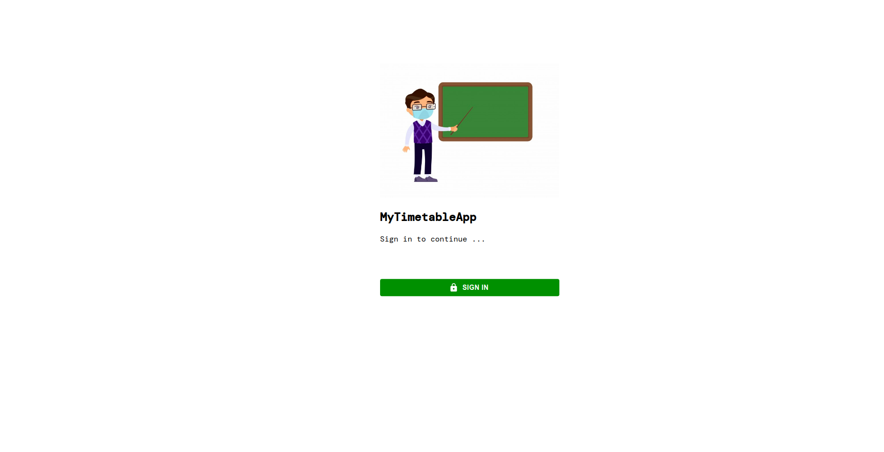
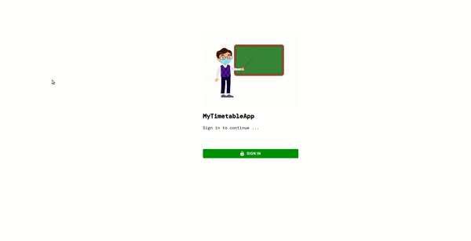
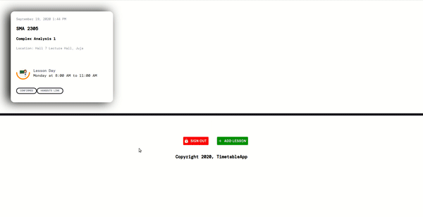
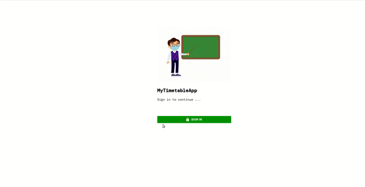

# TimetableApp

TimetableApp is a simple website application that teachers / lecturers can use to schedule classes. It is integrated with Google Calender so that every lesson for the week, can be viewed on both the app or your personal Google Calender. On a phone, push notifications have been enabled as remiders 30 minutes prior to a lesson. Upon a scheduled lesson, the respective lecturer also receives an email with details of the lesson ie. unit name, unit code, lesson duration and class location (which can be accessed via Google Maps too).

## Overview

* Upon loading the website, if the user had not logged in before, the login page is displayed.



* Below is the sign in procedure



* Upon successful sign in, a user can now schedule lessons. Add units, locations to different lectures.



* The units / lecture locations and time can be viewed in ones account



## Setup / Installation

* Follow the instructions as outlined in the [Google Calendar Developer Docs](https://developers.google.com/calendar/quickstart/js) to generate a ClientId and API token for your project. Use them as your credentials.

* Clone the project on your machine then on your terminal, run: (To run npm you should have installed Nodejs on your machine, if not install it from here: [Nodejs Installation](https://nodejs.org/en/))

```bash
npm install
```

navigate to **localhost:3000** on your browser you should be able to view the website.

## Contributing

Pull requests are welcome. For major changes, please open an issue first to discuss what you would like to change.

Please make sure to update tests as appropriate.

## License

[MIT](https://choosealicense.com/licenses/mit/)

* This project was bootstrapped with [Create React App](https://github.com/facebook/create-react-app).
